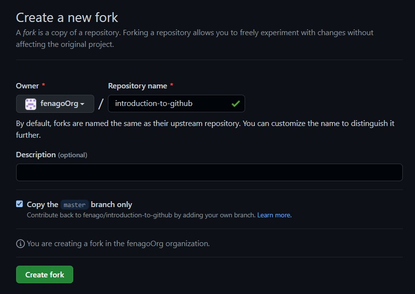

# Introduction to GitHub

People use GitHub to build some of the most advanced technologies in the world. Whether you’re visualizing data or building a new game, there’s a whole community and set of tools on GitHub that can help you do it even better.

- **Who is this for**: New developers, new GitHub users, and students.
- **What you'll learn**: We'll introduce repositories, branches, commits, and pull requests.
- **What you'll build**: We'll make a short Markdown file you can use as your `profile README`.
- **Prerequisites**: None. This course is a great introduction for your first day on GitHub.
- **How long**: This course is four steps long and takes less than one hour to complete.

## How to start this course

1. Open following URL in browser, click **Fork** and open the link in a new tab.
   `https://github.com/fenago/introduction-to-github`

   
2. In the new tab, follow the prompts to create a new repository.
   - For owner, choose your personal account or an organization to host the repository.
   
   
3. After your new repository is created, wait about 20 seconds, then refresh the page. Follow the step-by-step instructions in the new repository's README.

<summary><h2>Step 1: Create a branch</h2></summary>

_Welcome to "Introduction to GitHub"! :wave:_

**What is GitHub?**: GitHub is a collaboration platform that uses Git for versioning. GitHub is a popular place to share and contribute to open-source software.

**What is a repository?**: A `repository` is a project containing files and folders. A repository tracks versions of files and folders.

**What is a branch?**: A `branch` is a parallel version of your repository. By default, your repository has one branch named `main` and it is considered to be the definitive branch. You can create additional branches off of `main` in your repository. You can use branches to have different versions of a project at one time.

On additional branches, you can make edits without impacting the `main` version. Branches allow you to separate your work from the `main` branch. In other words, everyone's work is safe while you contribute.


**What is a profile README?**: A `profile README` is essentially an "About me" section on your GitHub profile where you can share information about yourself with the community on GitHub.com. GitHub shows your profile README at the top of your profile page.

###  Activity: Your first branch

1. Open a new browser tab, and navigate to this same repository. Then, work on the steps in your second tab while you read the instructions in this tab.
2. Navigate to the **Code** tab.
3. Click on the **main** branch drop-down.<br>
   
4. In the field, enter a name for your branch: `my-first-branch`.
5. Click **Create branch: my-first-branch** to create your branch.
6. Move on to Step 2!<br>


<summary><h2>Step 2: Commit a file</h2></summary>

_You created a branch! 

Creating a branch allows you to edit your project without changing the `main` branch. Now that you have a branch, it’s time to create a file and make your first commit!

**What is a commit?**: A `commit` is a set of changes to the files and folders in your project. A commit exists in a branch.

###  Activity: Your first commit

The following steps will guide you through the process of committing a change on GitHub. Committing a change requires first adding a new file to your new branch. 

1. On the **Code** tab, make sure you're on your new branch `my-first-branch`.
2. Select the **Add file** drop-down and click **Create new file**.<br>
   
3. In the **Name your file...** field, enter `PROFILE.md`.
4. In the **Edit new file** area, copy the following content to your file:
   ```
   Welcome to my GitHub profile!
   ```
   
5. For commits, you can enter a short commit message that describes what changes you made. This message helps others know what's included in your commit. GitHub offers a simple default message, but let's change it slightly for practice. First, enter `Add PROFILE.md` in the first text-entry field below **Commit new file**. Then, if you want to confirm what your screen should look like, expand the dropdown below.
   
   <summary> Expand to see the screenshot.</summary>
   
   
6. In this lesson, we'll ignore the other fields and click **Commit new file**.
7. Move on to Step 3! <br>


<summary><h2>Step 3: Open a pull request</h2></summary>

_Nice work making that commit :sparkles:_

Now that you’ve created a commit, it’s time to share your proposed change through a pull request!

**What is a pull request?**: Collaboration happens on a pull request. The pull request shows the changes in your branch to other people. This pull request is going to keep the changes you just made on your branch and propose applying them to the `main` branch.


###  Activity: Create a pull request

You may have noticed after your commit that a message displayed indicating your recent push to your branch and providing a button that says **Compare & pull request**.


 If you want, feel free to click **Compare & pull request**, and then skip to step 6 below. If you don't click the button, the instructions below walk you through manually setting up the pull request.

1. Click on the **Pull requests** tab in your repository.
2. Click **New pull request**.
3. In the **base:** dropdown, make sure **main** is selected.
4. Select the **compare:** dropdown, and click `my-first-branch`. <br>
   
5. Click **Create pull request**.
6. Enter a title for your pull request: `Add my first file`.
7. The next field helps you provide a description of the changes you made. Feel free to add a description of what you’ve accomplished so far. As a reminder, you have: created a branch, created a file and made a commit! <br>
   
8. Click **Create pull request**.
9. Move on to Step 4! <br>


<summary><h2>Step 4: Merge your pull request</h2></summary>

_Nicely done friend!

You successfully created a pull request. You can now merge your pull request.

**What is a _merge_**: A `merge` adds the changes in your pull request and branch into the `main` branch.

You'll have to wait before you can merge your pull request. You can merge when the merge pull request button is green.


### Activity: Merge the pull request

1. Click **Merge pull request**.
1. Click **Confirm merge**.
1. Once your branch has been merged, you don't need it anymore. To delete this branch, click **Delete branch**.<br>
   
2. Check out the **Finish** step to see what you can learn next!<br>

Here's a recap of your accomplishments:

- You learned about GitHub, repositories, branches, commits, and pull requests.
- You created a branch, a commit, and a pull request.
- You merged a pull request.
- You made your first contribution!

